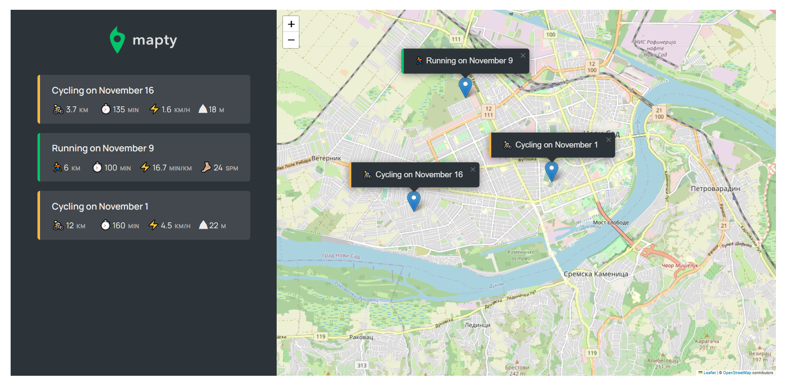

# mapty
MAPTY - Fitness Activity Tracker

MAPTY is a specialized fitness activity tracker designed for both runners and cyclists. 
It allows users to log their running sessions or cycling routes by customizing various parameters such as session type, duration, speed, cadence (for running), or elevation gain (for cycling). 

Developed using HTML, CSS, SASS, and JavaScript, this application also incorporates local storage to persist previous session data.

Features
Users can choose between two main activity modes:

Running: For tracking running sessions.

Cycling: For tracking cycling routes.

Activity Customization
For Running Sessions:
Duration: Input the session length in terms of time.
Cadence (Steps/Minute): Measure running pace by setting the steps per minute.
For Cycling Routes:
Duration: Set the duration of the cycling route.
Elevation Gain: Record the total ascent during the cycling session.
Performance Metrics
Based on the selected activity and provided parameters, the app calculates:

Running Speed: Calculated based on session duration and distance covered.
Cycling Speed: Derived from the distance and time taken.
Average Cadence (Running): Calculated based on steps per minute.
Elevation Gain (Cycling): Records the total ascent during the cycling session.

MAPTY incorporates location services to fetch the user's location, enabling the application to load the user's current location automatically. Users can then visualize and select their running or cycling routes directly on the map interface, enhancing the experience by offering a seamless way to track activities based on the chosen location.

Local Storage
MAPTY utilizes local storage to retain previous session data, ensuring continuity even when the app is closed or refreshed.

User Interface
The interface is user-friendly and intuitive, allowing seamless interaction and data entry.

Installation
Clone this repository to your local machine using git clone.
Open the index.html file in a web browser.
How to Use
Select the activity type (running or cycling).
Customize the session details based on the chosen activity type (duration, cadence, or elevation gain).
View and analyze performance metrics calculated by the app.
Previous session data will persist thanks to local storage.
Additional Notes
Enhance MAPTY further by:

